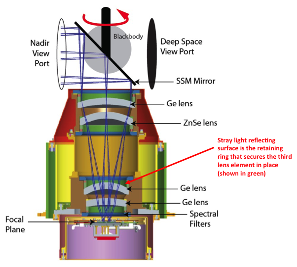
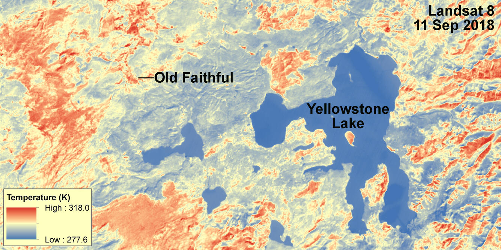
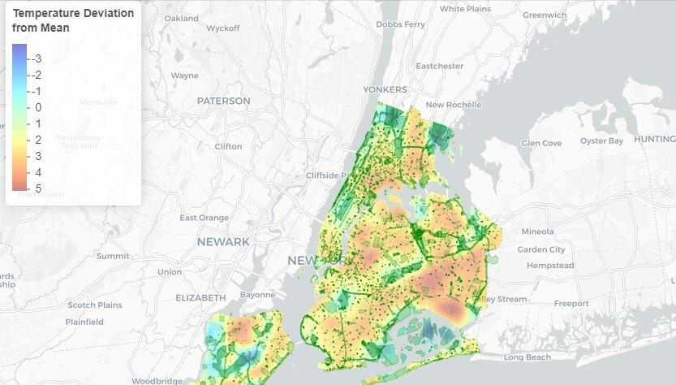
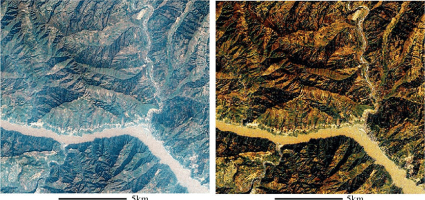
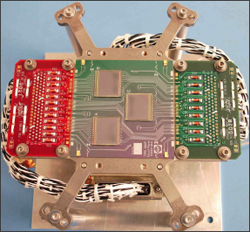
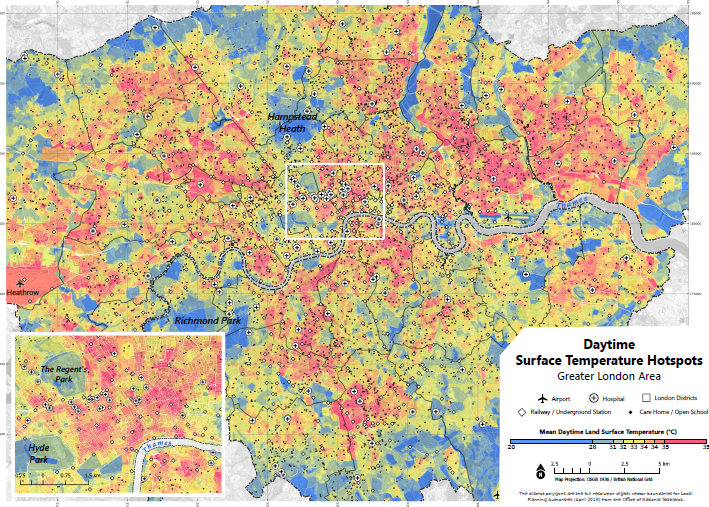

```{r setup, include=FALSE}
options(htmltools.dir.version = FALSE)

library(RefManageR)
BibOptions(check.entries = FALSE,
           bib.style = "authoryear",
           cite.style = "authoryear",
           style = "markdown",
           hyperlink = TRUE,
           dashed = FALSE,
           no.print.fields=c("doi", "url", "urldate", "issn"))
myBib <- ReadBib("./references.bib", check = FALSE)

library(knitcitations)
```

<!-- Slide 1: Cover -->
# Landsat 8: Thermal Vision for UHI

<video autoplay loop muted playsinline style="max-width: 100%; height: auto; position: fixed; top: 11.5%; left: 0;">
  <source src="https://landsat.gsfc.nasa.gov/wp-content/uploads/2023/09/L9-flyover-2.mp4" type="video/mp4">
  Your browser does not support the video tag.
</video>

---

<!-- Slide 2: Full Screen Video -->
<video controls playsinline style="width: 100vw; height: 80vh; object-fit: cover; position: fixed; top: 0; left: 0;" data-remark-pause="true">
  <source src="https://usgs-ocapsv2-public-output-media.s3.us-west-2.amazonaws.com/assets/palladium/production/s3fs-public/l8swath/MP4/l8swath.mp4#t=8" type="video/mp4">
  Your browser does not support the video tag.
</video>

---

<!-- Slide 3: Mission Overview -->
# Mission Overview

.pull-left[
**Launch & Objective:**
- Launched: Feb 11, 2013
- Mission: Earth observation for tracking environmental changes
- Global coverage of land surfaces

**Orbit & Coverage:**
- Altitude: 705 km
- Orbit: Sun-synchronous, ~10:00 AM equator crossing
- Revisit cycle: 16 days
- Swath width: 185 km
]

.pull-right[
**Key Capabilities:**
- ~740 scenes captured per day
- Free, open data access
- 12-bit radiometric depth
- 12 m geodetic accuracy


.center[Timeline of the Landsat Program – Credit: `r Citet(myBib, "TimelineLandsatScience2021")`]
]

---

<!-- Slide 4: TIRS Details -->
# TIRS: Thermal Infrared Sensor

.pull-left[
**Core Technology:**
- Developed by NASA Goddard Space Flight Center
- Employs Quantum Well Infrared Photodetectors (QWIP) technology semiconductor layers.
- Pushbroom sensor design

**Spectral Bands:**
- **Band 10 (TIRS1):** 10.6 – 11.19 µm
  - Primary band for surface temperature retrieval.
- **Band 11 (TIRS2):** 11.5 – 12.51 µm
  - Used in conjunction with Band 10 for atmospheric correction (split-window technique).
- **Spatial Resolution:**
  - 100-meter native resolution
  - Resampled to 30 meters in delivered data products for consistency with other Landsat 8 bands.
]

.pull-right[

.center[TIRS Design – Credit: `r Citet(myBib, "barsiLandsat8ThermalInfrared2014")`]
]

---

<!-- Slide 5: UHI Analysis -->
# Urban Heat Island Analysis

.pull-left[
**Data Processing Workflow:**
1. **Scene Selection:** Choose summer daytime scenes with clear skies.
2. **Thermal Calibration:** Convert digital numbers to radiance, then to brightness temperature.
3. **Corrections:** Apply atmospheric and emissivity corrections (split-window technique using Bands 10 & 11).
4. **Surface Temperature Retrieval:** Calculate Land Surface Temperature (LST) using the corrected brightness temperatures.
5. **Validation:** Compare derived LST with ground-based measurements if available.
]

.pull-right[
**Analysis Approach:**
- Generate LST maps to visualize temperature differences.
- Compare urban vs. rural areas.
- Use NDVI (from OLI Bands 4 & 5) to correlate vegetation with lower temperatures.
- Identify UHI “hot spots” within cities.


.center[LST map example – Credit: `r Citet(myBib, "LandsatCollection22024")`]
]

---

<!-- Slide 6: Urban Applications -->
# Urban Applications

.pull-left[
**City Heat Mapping:**
- Example: NYC heat vulnerability mapping.
- Identify hot spots in dense urban centers vs. cooler suburban areas.
- Analyse temperature variations across different land cover types (e.g., impervious surfaces, green spaces).

**Impact Assessment:**
- Evaluate cooling effects of green infrastructure (e.g., green roofs, parks, urban forests).
- Inform urban policy and planning decisions related to heat mitigation and adaptation.
- Assess the effectiveness of different cooling strategies (e.g., increasing tree canopy cover, using high-albedo materials).
- Quantify the relationship between urban morphology (building density, street canyons) and temperature.
]

.pull-right[
**Case Study: NYC**
- Landsat 8 reveals significant temperature variations across city neighborhoods.
- Data supports initiatives for urban cooling strategies.


.center[NYC Urban Heat Map – Credit: `r Citet(myBib, "UrbanHeatNew2022")`]
]

---

<!-- Slide 7: Technical Challenges -->
# Technical Challenges

.pull-left[
**Atmospheric & Calibration Challenges:**

- **Atmospheric Effects:** Water vapor and aerosols affect thermal measurement accuracy, causing a ~1K error even after corrections.

- **Stray Light Correction:** TIRS Band 11 initially had errors from stray light, corrected by an algorithm in later data versions.

- **Data Version:** Use Landsat Collection 2 data for accurate analysis, as it includes the stray light correction and other improvements.
]

.pull-right[
**Spatial & Temporal Limits:**
- 100 m native thermal resolution can mix different surface types.
- 16-day revisit may miss short-term events.
- Cloud cover can obstruct observations during critical periods.


.center[Atmospheric Correction – Credit: `r Citet(myBib, "chenLandUseLand2010")`]
]

---

<!-- Slide 8: Future Prospects -->
# Future Directions

.pull-left[
**Landsat 9 TIRS-2 Enhancements:**
- Launched in September 2021, Landsat 9's TIRS-2 significantly reduces stray light (by 40×), a major improvement over Landsat 8's TIRS.
- Features enhanced redundancy and improved calibration, particularly for Band 11, leading to more accurate temperature measurements.

**Landsat Next Advances:**
- Planned for launch in the late 2020s, Landsat Next will feature a superspectral thermal imager.
- It is designed to provide significantly higher spatial resolution (down to 60 meters for thermal bands).
- Landsat Next aims for a temporal revisit of less than six days, enabling more frequent monitoring of thermal dynamics.
]

.pull-right[
**Integration & Next Steps:**
- Combined use of Landsat 8 and 9 for an ~8-day revisit.
- Integration with Sentinel-3 SLSTR and future Landsat Next for improved thermal resolution.
- Potential for real-time urban heat monitoring using cloud platforms.


.center[TIRS-2 Design – Credit: `r Citet(myBib, "TIRS2DesignLandsat2021a")`]
]

---

<!-- Slide 9: Personal Reflection -->
# Reflection

.pull-left[Working with Landsat 8’s TIRS has been really fun! Landsat 8, launched in 2013, carries foward a fascinating history of Earth observation. I was impressed by how its advanced thermal sensors, with dual thermal bands and 12-bit radiometric resolution, can capture even subtle differences in surface temperatures helping tackling UHI.

The continuity of Landsat data over more than 40 years offers a unique perspective on how cities have grown and how environmental challenges have evolved. It’s fascinating to think that today’s high-quality thermal imagery is built upon decades of past missions, each contributing to our collective understanding of Earth’s surface.]


.pull-right[
[Summer Heat Spots with Landsat-8 Thermal Satellite data – Credit: `r Citet(myBib, "MajorSummerHeat")`]]
---

<!-- Slide 10: References -->
# References

```{r, results='asis', echo=FALSE}
PrintBibliography(myBib)
```
